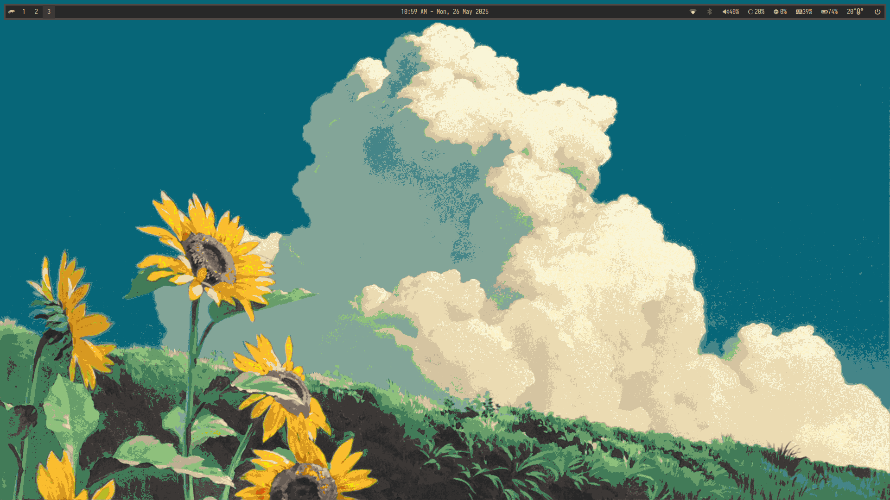
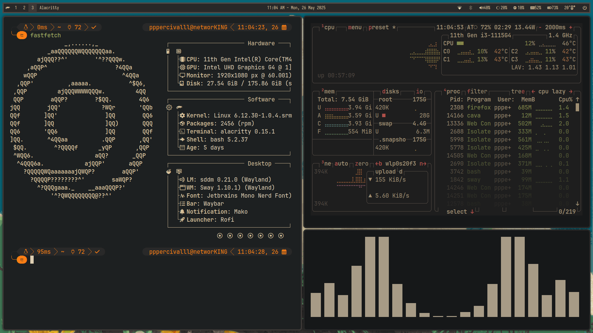

# My SUSESway.Files

> My Gruvbox themed desktop but with eye candy Wayland window tiling compositor, openSUSESwayFX.

---

## 📦 Components

| Component  | Description |
|------------|-------------|
| SwayFX     | Tiling Wayland compositor that forked from i3WM but with eye candy|
| Swww       | Highly efficient and lightweight wallpaper generator  |
| Alacritty  | OpenGL based terminal |
| Yazi       | Blazing fast terminal file manager|
| Fastfetch  | Fast system fetch tool with custom ASCII/logo |
| Cava       | Terminal-based audio visualizer |
| Waybar     | Top bar replacement with module support |
| Wlogout    | Logout menu for wayland environments |
| Cava       | Terminal-based audio visualizer |
| Rofi       | Application launcher, an alternative to Wofi in Wayland environment |
| NWG-Look   | GTK settings editor, designed to work properly in wlroots-based Wayland environment  |
| Mako       | Lightweight notification daemon for Wayland compositor  |
| Swaylock   | Screenlocker for Sway environment |
| GTK-Lock   | An alternative to Swaylock  |
| ETC        | And et cetera |

---

## 🧰 System Info

| Type               | Details                                                 |
|--------------------|---------------------------------------------------------|
| **Distro**         | openSUSE Slowroll                                       |
| **Window Manager** | SwayFX                                                  |
| **Display Server** | Wayland                                                 |
| **Terminal**       | Alacritty                                               |
| **Font**           | JetBrains Mono/Iosevka/Geist Mono (Nerd Font)           |
| **Display Manager**| SDDM (https://github.com/Keyitdev/sddm-astronaut-theme) |
| **Shell**          | Bash with BLE (https://github.com/akinomyoga/ble.sh)    |
| **Bar**            | Waybar                                                  |
| **Theme**          | Gruvbox (https://www.gnome-look.org/p/1681313)          |
| **Icon**           | Gruvbox (https://www.gnome-look.org/p/1961046)          |
| **Cursor**         | Future Cursor (https://www.gnome-look.org/p/1457141)    |

---

## 📸 More Screenshot(s)

---
